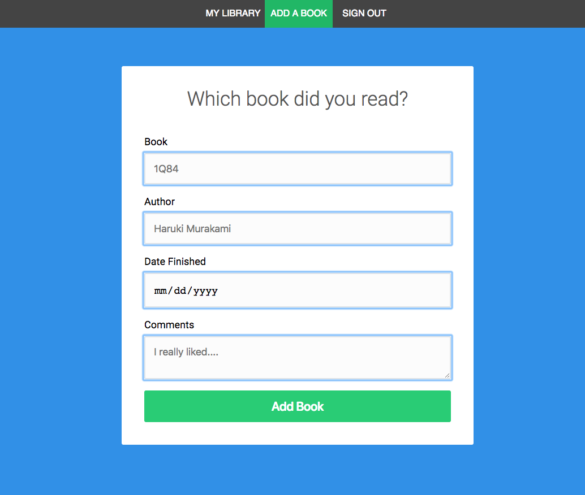
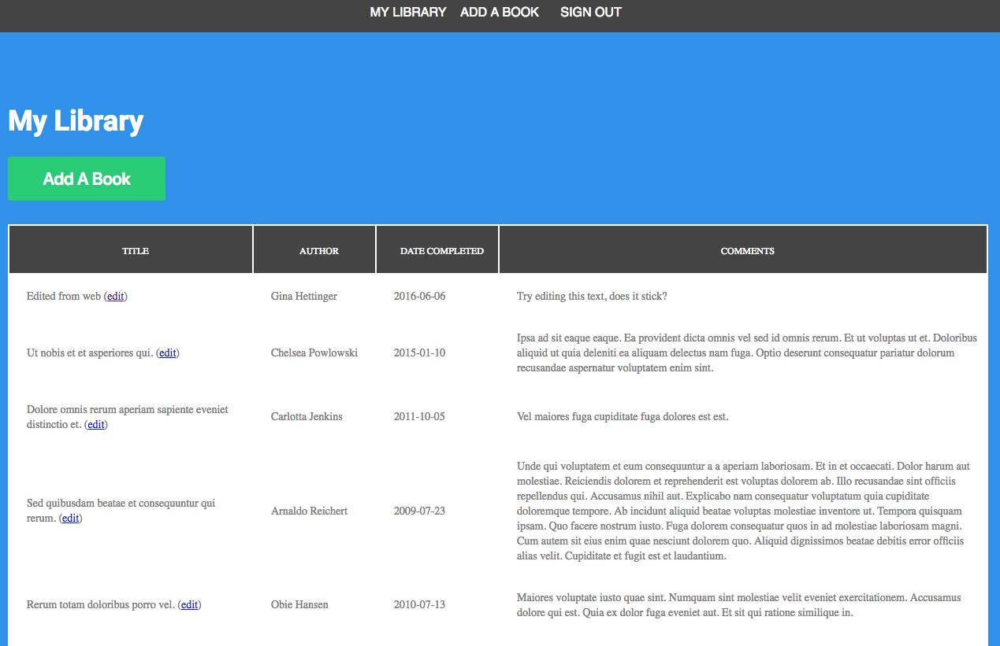
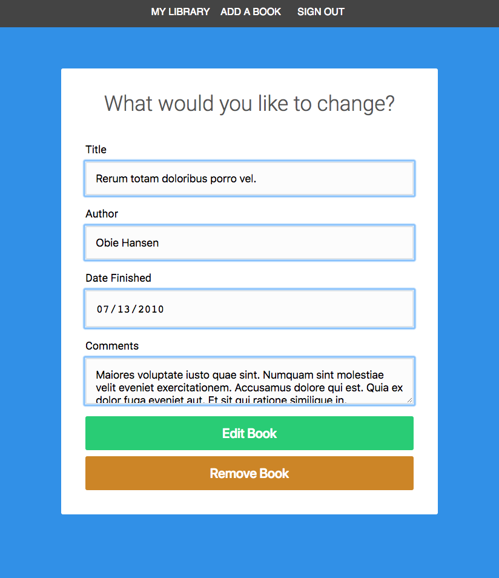

# MyLibrary
A simple webapp for storing a private library of books you've read.

## Screenshots:

### Add a book to your library:

### View your library:

### Edit or remove a bookf rom your library:

